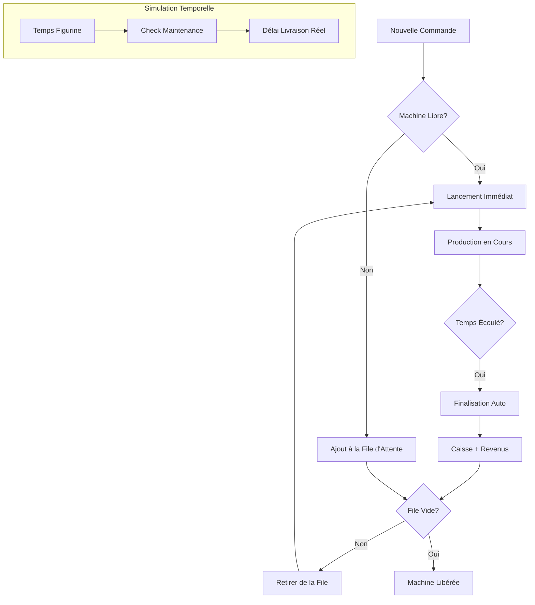

# Suivi des Mises à Jour - Usine Pokémon (Mode Industriel)

Ce fichier documente les changements apportés pour transformer l'usine en un système industriel automatisé.

## [21/02/2026] - Passage au Pipeline Industriel

### 1. Modification des Structures (`structures.h`)
- **Changement** : Ajout de `liste_commande* file_attente` dans `struct Machine`.
- **Pourquoi** : Pour permettre à une machine de stocker plusieurs commandes à la suite au lieu de s'arrêter après une seule.
- **Comment** : Utilisation d'une liste chaînée de commandes intégrée directement dans la structure de la machine.

### 2. Simulation Temporelle Prédictive (`machine.c`)
- **Changement** : Implémentation de `simuler_temps_et_compteur`.
- **Pourquoi** : Pour donner une estimation réelle du temps de fin, incluant les pauses de maintenance obligatoires.
- **Comment** : Algorithme simulant cycle par cycle la production et injectant 2 minutes de délai à chaque fois que le compteur atteint le maximum.

### 4. Persistance Avancée (`fichiers.c`)
- **Changement** : Reconstruction des files d'attente à partir des IDs stockés.
- **Pourquoi** : Pour que l'état de l'usine soit préservé même après un redémarrage du programme.
- **Comment** : Format de fichier modifié (`ID1,ID2,ID3`) et parsing manuel avec `strtok`.

### 5. Aide au Diagnostic
- **Changement** : Nouvelle fonction `afficher_temps_attente_file`.
- **Pourquoi** : Permet au gestionnaire de l'usine de voir le planning complet d'une machine.
- **Comment** : Calcul cumulatif basé sur la simulation prédictive.
### 6. Fin du "Clipping" de Production (`machine.c`)
- **Changement** : `lancer_production` accepte désormais la quantité totale demandée.
- **Pourquoi** : Auparavant, la machine s'arrêtait dès qu'elle atteignait son seuil de maintenance.
- **Comment** : Utilisation de la simulation pour inclure le temps de maintenance directement dans le délai de livraison global.
### 7. Sélection Intelligente de la Machine (`machine.c`)
- **Changement** : `trouver_machine_libre_pour_pokemon` ne cherche plus seulement des machines "vides".
- **Pourquoi** : Avec le système de file, on peut assigner une commande même si la machine travaille.
- **Comment** : La fonction cherche maintenant priorité à une machine **LIBRE**, sinon elle choisit celle qui a la **file d'attente la plus courte**.
## Schéma du Pipeline de Production Industriel

Voici comment les commandes transitent désormais dans votre usine :

### Détails du flux :
1.  **Entrée** : Une commande est créée et assignée via le menu 5.
2.  **Aiguillage** : La fonction `trouver_machine_libre_pour_pokemon` choisit la machine la moins chargée.
3.  **Simulation** : Le système calcule immédiatement la date de fin réelle en simulant les futures pannes (maintenances).
4.  **Auto-Pilote** : La fonction `mettre_a_jour_machines` (appelée dans la boucle principale) surveille l'horloge. Dès qu'une production finit, elle encaisse l'argent et regarde s'il y a une file d'attente pour enchaîner immédiatement.
5.  **Entretien** : Si une maintenance est requise pendant le lot, elle est effectuée automatiquement et le délai est ajusté.
